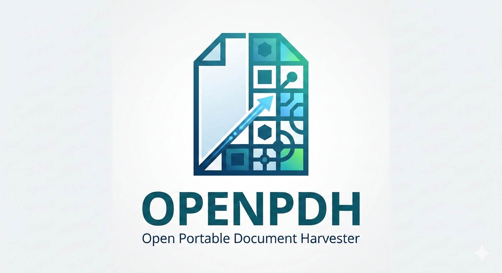

<p align="center">
  
</p>

<p align="center">
  A browser-only tool for extracting structured data from PDFs by defining rectangular reading zones.<br/>
  All processing is client-side — no data leaves your browser.
</p>

## How it works

1. **Configure** — Upload a sample PDF, draw rectangles over the areas you want to extract, and assign field names to each zone
2. **Harvest** — Upload any PDF with the same layout, and get structured JSON output instantly
3. **Manage** — List, delete, import, and export your extraction configurations

## Tech Stack

- **Frontend:** React 19 + TypeScript + Mantine UI v8
- **Build:** Vite
- **PDF Processing:** pdf.js (character-level text extraction)
- **Storage:** localStorage (browser-only, no server)

## Getting Started

```bash
npm install
npm run dev
```

### Docker

```bash
docker compose up --build
```

Serves the app via nginx on port 8080.

## Available Scripts

| Command | Description |
|---------|-------------|
| `npm run dev` | Start Vite dev server |
| `npm run build` | TypeScript check + production build |
| `npm run lint` | Run ESLint |
| `npm run preview` | Preview production build locally |

## How Extraction Works

Area coordinates are stored as percentages (0–100) of page dimensions, making templates resolution-independent. During extraction, pdf.js reads individual characters from the PDF, filters those falling within each defined rectangle, and reconstructs lines by sorting on Y then X position.

## Completed

- [x] PDF rendering with canvas and page navigation
- [x] Draw rectangular reading zones on PDF overlay
- [x] Percentage-based coordinate system (resolution-independent templates)
- [x] Assign field names to each zone
- [x] Live text preview per area during configuration
- [x] Character-level text extraction using pdf.js
- [x] Create, edit, and delete extraction configurations
- [x] Import/export configurations as JSON (single or all)
- [x] Conflict detection on import with overwrite confirmation
- [x] Extract structured JSON from any PDF matching a template
- [x] Download extracted data as JSON/CSV
- [x] PDF preview with zone overlay during extraction
- [x] Page rotation support
- [x] Responsive layout (mobile/desktop)
- [x] Docker deployment with nginx
- [x] Fully client-side — no data leaves the browser
- [x] Export extracted data as XML payment order
- [x] Process multiple PDFs at once
- [x] PWA support (install as desktop app, work offline)

## Future Roadmap

### Smarter extraction
- [ ] Regex post-processing per field (strip currency symbols, normalize dates)
- [ ] Field type hints (date, number, currency) with validation
- [ ] Multi-line table extraction (detect repeating rows within a zone)
- [ ] Fallback zones (try alternative location if primary zone is empty)

### Template management
- [ ] Template versioning (config change history)
- [ ] Share configs via URL
- [ ] Config tagging/folders for organization

### UX improvements
- [ ] Keyboard shortcuts (arrow keys, delete zone)
- [ ] Snap-to-text (auto-align rectangles to detected text boundaries)
- [ ] Zoom and pan on the PDF viewer
- [ ] Undo/redo for zone drawing
- [ ] Drag to move/resize existing rectangles

### Integration
- [ ] Browser extension (extract from PDFs opened in the browser)

### Data pipeline
- [ ] Extraction history log
- [ ] Diff view (compare extracted data between two PDFs)
- [ ] Validation rules per field (valid IBAN, regex match)

## Need a custom tool, integration, or web application?

Let's talk.

- [LinkedIn](https://www.linkedin.com/in/martin-soovali/)
- cemption@gmail.com
